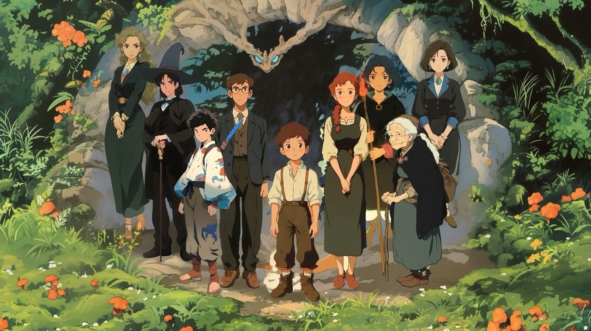
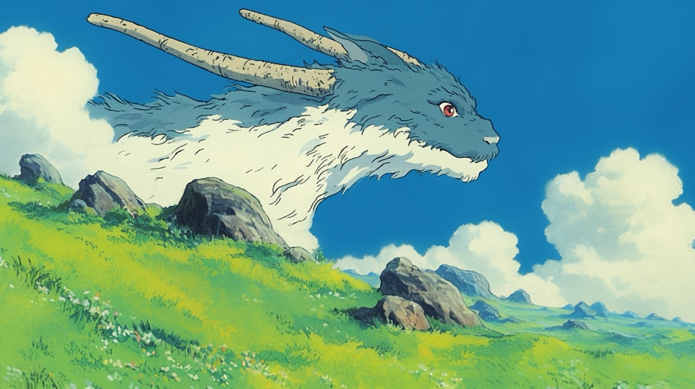
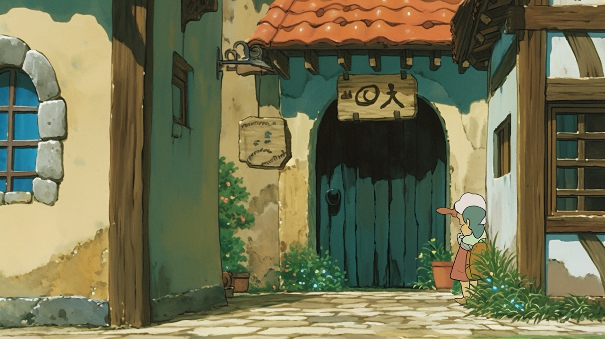
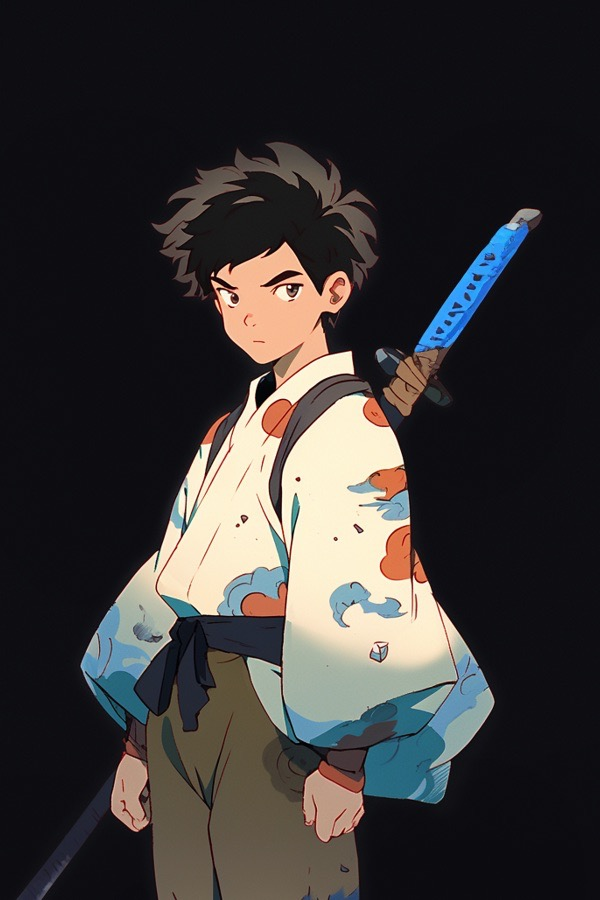
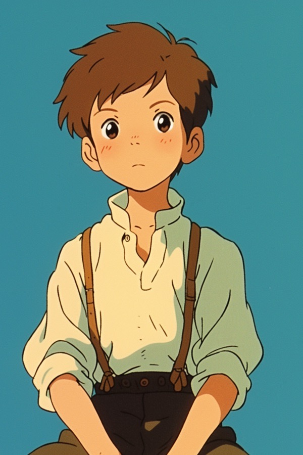
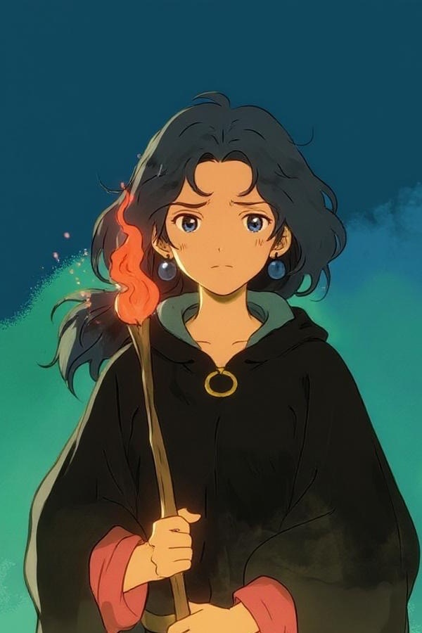

---

#### Overview

+ [Watch on YouTube](https://youtu.be/LHHxG8dsZco)

|||
|---|---|
|    |   |

The rapid evolution of AI creative tools today has transformed how we bring imagination to life. I've always had those fleeting images in my mind, with these tools, they can now be crafted into visual narratives quickly.

The Antlered Prince is an animated short film that explores the profound themes of difference, belonging, and the courage required for self-acceptance. Set in a dreamlike world where reality blends seamlessly with fantasy, the story follows a silent boy who cannot speak as he discovers that what makes him different isn't a flaw to hide—it's a gift to embrace.

In a society that often demands conformity, this film celebrates the nobility found in being authentically ourselves. It's a story for anyone who has ever felt like an outsider, reminding us that our perceived differences are often our strengths.

##### AI Workflow
||||
|---|---|---|
|    |   |   |

**Story Development & Screenplay**
- Claude & Gemini: These language models served as collaborative partners in developing the storyline, transforming rough concepts into structured narratives. I employed a unique approach of using different LLMs to critique and refine the story, ensuring the core themes resonated authentically.

**Visual Design**
- Midjourney: The primary tool for generating character designs and background environments. Its distinctive aesthetic capabilities and the styleRef parameter proved invaluable for maintaining visual consistency throughout the film.

**Consistency Solutions**
- Character consistency across scenes was initially challenging, but breakthrough tools like Flux Kontext and Runway Gen-4 revolutionized this process. These platforms enable precise character edits while preserving visual continuity.
- Tip: When integrating characters into large scenes, I found it more effective to first place them in smaller portions of the frame, then blend these elements into the broader background. Inpainting and outpainting tools proved essential for seamless integration.

**Video Generation**
- The animation primarily utilized image-to-video models including:
- Veo3: For high-quality motion generation
- Midjourney: Video capabilities for style consistency
- Seedance: Particularly useful for multi-shot scene creation, adding narrative depth through varied perspectives
- Using reference images as guides for video generation proved crucial for maintaining visual coherence across sequences.

**Audio Production**
- ElevenLabs: Primary tool for text-to-speech generation, providing natural-sounding narration
- SUNO: Music composition and soundtrack creation, perfectly complementing the film's emotional arc

**Post-Production**
- CapCut: Currently serving as the primary editing platform, chosen for its user-friendly interface and some built-in AI enhancement features. The search continues for more specialized AI-native editing tools as the field rapidly evolves.