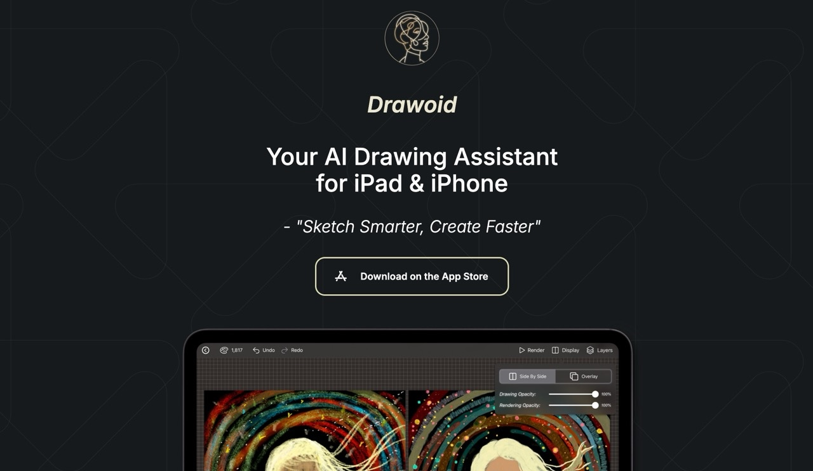
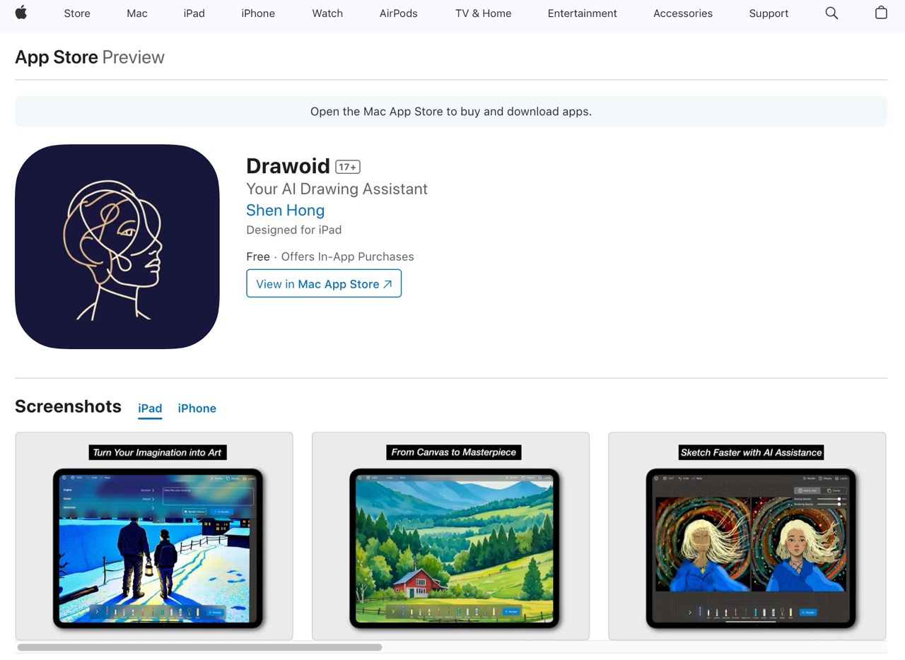
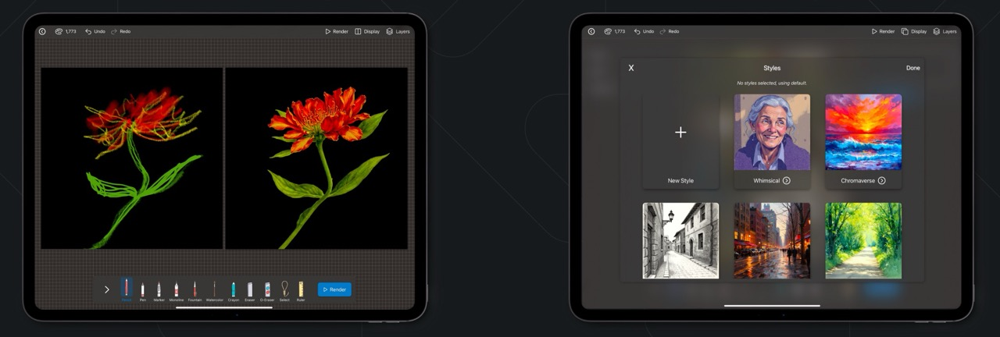
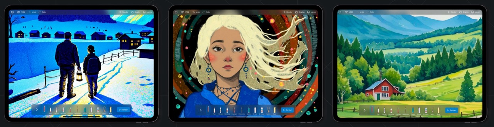
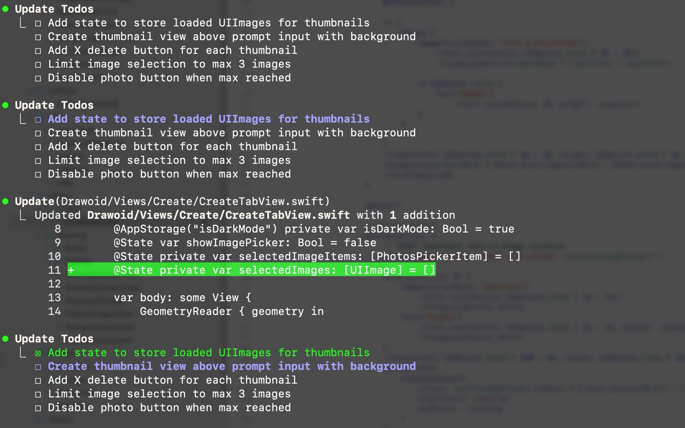

---

#### Links
+ [Landing Page](https://drawoid.pages.dev/)

+ [App Store](https://apps.apple.com/gb/app/drawoid/id6743011633)

---

#### Summary

As a software developer, I've always been fascinated by the intersection of creativity and technology. And Drawoid was a personal project aimed at exploring the capabilities of generative AI in a practical, artistic application for iOS. I've been a user of Procreate and a bunch of drawing tools as well, and my goal was to create more than just another drawing app, which is an intelligent assistant that could empower people to bring ideas to life faster and in new ways.

The core of the app is a rendering engine using Image-to-Image AI models that can transform rough sketches into polished artwork as you draw, and also a suite of AI-powered editing tools, including inpainting to add or remove elements with text prompts, style transfer, and background removal.

This entire project was also a journey of learning, not just in mobile development but also in development efficiency with the assitance of AI, particularly Claude Code. Structurnig the files, writubg boilerplate, and refactoring / debugging complex issues, which was an valuable learning for a side project like this.

---

##### Some Claude Code Tips

- A good Claude.md file can produce the result much better. Especially for large features or changes, making plans vs no plans could result in so much difference. Plus, you can also chime in the development philoshoy, to use and follow the exisitng code style and structure, to break down big requirements and start small, and also add instruction for testing and verifications here are some examples: https://github.com/hesreallyhim/awesome-claude-code.

- As Claude Code can automatically run xcode to help compile the edited code, you can add `xcbeautify -quieter` to help save tokens. On the other hand, to automate things even more, you could use a XCode MCP server that allows Claude Code to use more tools, including the Simulator testing, example MCP: https://github.com/cameroncooke/XcodeBuildMCP.

- Context is very much the key, sometimes iterating with Claude Code over multiple turns might produce the result you want, especially for debugging.

- Furthermore, you can mix the use of multiple CLI tools like gemini, which has a bigger context window, to read your codebase first, and generate (or improve) a plan or description for certain features, then hand over the plan to Claude Code for execution. 

- 

---

##### Tech Stacks

- iOS: SwiftUI, PencilKit, CoreData
- Backend: NodeJS, Serverless, Cloud Inference Providers
- Authentication: Apple's and Google's OIDC

---
